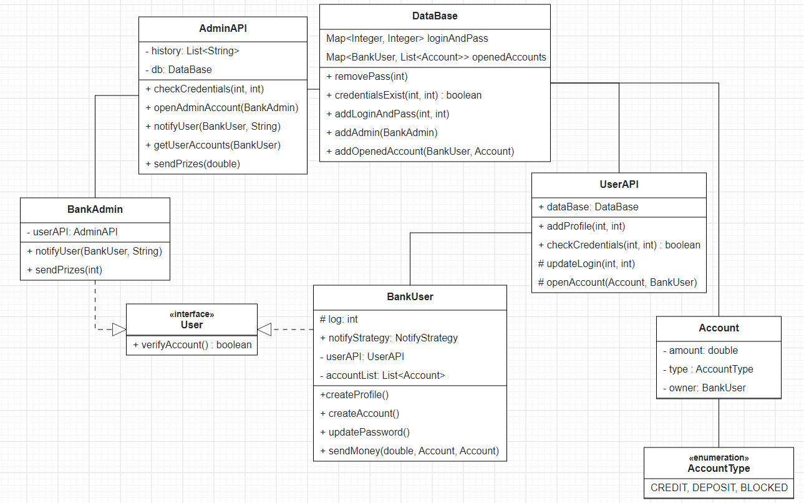

### Описание проекта

В данном проекте реализовано приложение для банка НеНаМели, что оно подходит для использования принципов ООП и особенностей языка программирования Java.

Здесь будет реализовано консольное приложение как для клиентов, так и для 
сотрудников банка, причем клиенты будут иметь возможность как открывать новые счета (кредиты и депозиты), так и отправлять деньги другим пользователям в пределах данного банка.
Сторона сотрудников банка будет выполнять роль оповещения пользователей о тех или иных вводимых функциях банка, оповещения отдельных пользователях о скором сроке истечения действия банковских продуктов, и так далее.

### UML-диаграмма проекта

